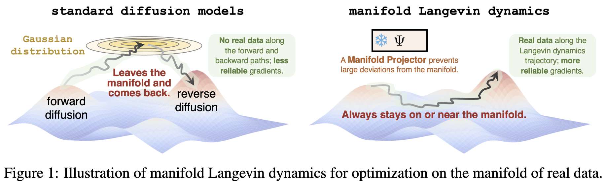
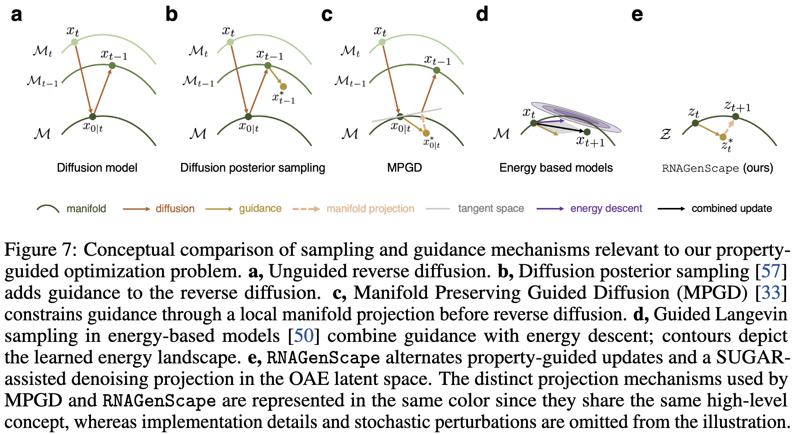
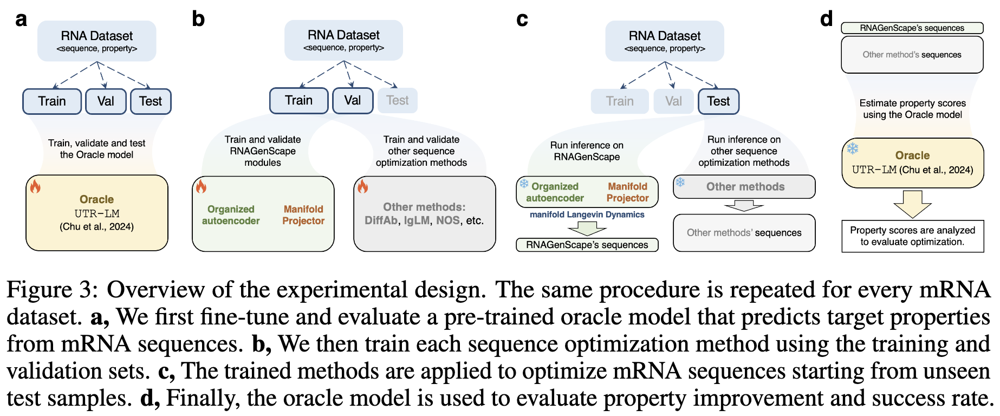

<div align="center">

  <h1><code>RNAGenScape</code></h1>

  [](https://arxiv.org/abs/2510.24736)
  [](https://arxiv.org/pdf/2510.24736)
  [](https://github.com/ChenLiu-1996/RNAGenScape)
  <br>[](https://www.linkedin.com/in/danqi-liao-4852aba9/)
  [](https://www.linkedin.com/in/chenliu1996/)
  [](https://www.linkedin.com/in/xingzhi-sun)
  <br>[](https://scholar.google.com/citations?user=3rDjnykAAAAJ&sortby=pubdate)
  [](https://scholar.google.com/citations?user=tUvfTd8AAAAJ)
  <br>[](https://x.com/DanqiLiao73090)
  [](https://x.com/ChenLiu_1996)
  [](https://x.com/https://x.com/XingzhiSun)
  [](https://x.com/KrishnaswamyLab)

</div>

This is the author's repository for the NeurIPS 2026 paper
<br>[RNAGenScape: property-guided, optimized generation of mRNA sequences with manifold Langevin dynamics](https://arxiv.org/pdf/2510.24736).

The official version is hosted at the [Lab GitHub repo](https://github.com/KrishnaswamyLab/RNAGenScape).

<br>

#### Why would we emphasize "on-manifold"?


<br>

#### Overview of the method



<br>

#### Conceptual comparison



<br>

## Environment

Requires [uv](https://docs.astral.sh/uv/) and Python >= 3.12.

```bash
cd /path/to/RNAGenScape

# Create / sync the virtualenv from the lockfile
uv sync --python 3.12

# Activate
source .venv/bin/activate
```

### Cluster note (Misha / PyG)

`torch-scatter` is built from source on clusters with older glibc. Load a newer GCC **only while building**, then unload it before running Python (leaving GCC loaded can break the torch_scatter ABI):

```bash
module load GCC/12.2.0 CUDA/12.2.2
UV_HTTP_TIMEOUT=600 CXX=$(which g++) CC=$(which gcc) uv sync --python 3.12
module unload GCC
```


## Pretrained UTR-LM weights

Oracle training for `UTRLM` starts from the official pre-trained checkpoint (not domain-specific fine-tuned versions). Download:

```bash
mkdir -p checkpoints/utrlm
curl -L -o checkpoints/utrlm/utrlm_pretrained_siss_ep93.pkl \
  "https://raw.githubusercontent.com/a96123155/UTR-LM/main/Model/Pretrained/ESM2SISS_FS4.1_fiveSpeciesCao_6layers_16heads_128embedsize_4096batchToks_lr1e-05_supervisedweight1.0_structureweight1.0_MLMLossMin_epoch93.pkl"
```

Source: [a96123155/UTR-LM](https://github.com/a96123155/UTR-LM/tree/main/Model/Pretrained).


## RhoFold (optional folding confidence)

pLDDT evaluation uses the public [ml4bio/RhoFold](https://github.com/ml4bio/RhoFold) code and [Hugging Face weights](https://huggingface.co/cuhkaih/rhofold). Nothing under lab-private GPFS is required.

```bash
# One-time setup (clones into external_src/, downloads checkpoint, installs Bio/etc.)
bash bash/setup_rhofold.sh
# Or: uv sync --extra rhofold

# Or let eval auto-download the checkpoint once the source tree exists:
python src/evaluation/eval_rhofold.py --dataset OpenVaccine --model DiffAb --experiment pos_guided
```

Defaults:

- Code: `external_src/RhoFold`
- Weights: `external_src/RhoFold_pretrained/RhoFold_pretrained.pt`

Override with `RHOFOLD_DIR` / `RHOFOLD_CKPT` or `--rhofold_dir` / `--ckpt` if you already have a local install.


## Data

Datasets live under `data/` (gitignored; present on disk after setup).

**Primary experiment files:**

- OpenVaccine: ~2k samples
- Zebrafish: ~55k samples
- RibosomeLoading: ~260k samples


## Experiments



<br>

The same procedure is used for each dataset (train / val / test split):

1. **Oracle.** Fine-tune (or load) a property predictor and check it on the held-out test set. This model is used only for final evaluation, not for guiding generation.
2. **Train RNAGenScape.** Fit the OAE on the training and validation sets (SUGAR to hole-fill the sparse manifolds). Train the manifold projector if it is a parameterized by a learnable DAE module (skip if using a kNN projector).
3. **Generate.** Encode unseen test sequences, run fitness-guided Langevin in latent space with periodic manifold projection, and decode to new sequences.
4. **Evaluate.** Score start vs. generated sequences with the frozen oracle (property improvement and related metrics).


## Citation

If you use RNAGenScape, please cite the paper:

```
@inproceedings{liao2026rnagenscape,
  title={RNAGenScape: Property-Guided, Optimized Generation of mRNA Sequences with Manifold Langevin Dynamics},
  author={Liao, Danqi and Liu, Chen and Sun, Xingzhi and Tang, Di{\'e} and Wang, Haochen and Youlten, Scott and Gopinath, Srikar Krishna and Lee, Haejeong and Strayer, Ethan C and Giraldez, Antonio J and others},
  booktitle={Advances in neural information processing systems},
  year={2026},
}
```
